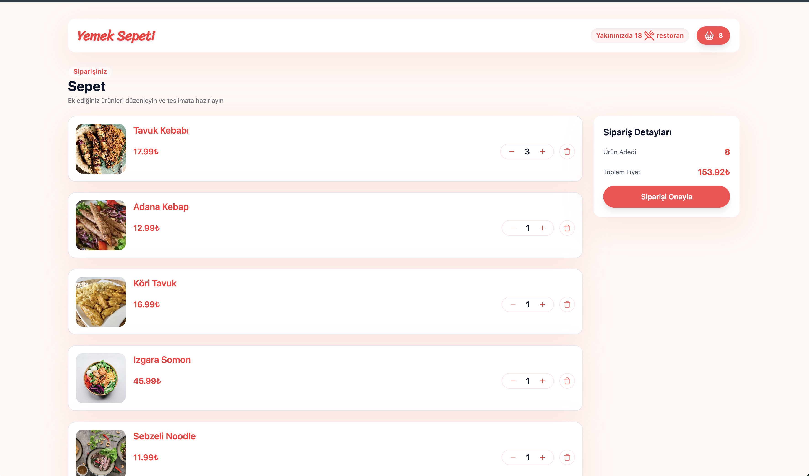
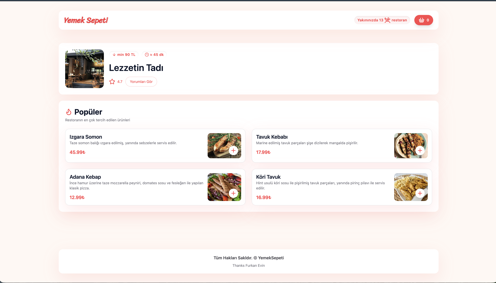

# 🍽️ Yemek Sepeti Clone

A full-stack food delivery web application built with React, Redux, and JSON Server — inspired by Turkey's popular food ordering platform Yemeksepeti.

---

## 🚀 Demo


---

## 📸 Screenshots

<p align="center">
  
</p>

<p align="center">
  
  
  
</p>

---

## ✨ Features

- 🏠 Restaurant listing with filtering
- 🍕 Product details per restaurant
- 🛒 Cart management (add / remove / update)
- 📦 Redux state management
- 🔌 REST API with JSON Server
- ⚡ Fast development with Vite

---

## 🛠️ Tech Stack


---

## ⚙️ Installation

```bash
# Clone the repository
git clone https://github.com/numanbalik72/yemeksepeti-pro.git

# Install dependencies
npm install

# Start JSON Server (port 3000)
npm run server

# Start development server (port 5173)
npm run dev

src/
├── components/
│   ├── error/
│   ├── footer/
│   ├── header/
│   └── loader/
├── pages/
│   ├── cart/
│   ├── home/
│   └── restaurant/
├── redux/
│   ├── actions/
│   ├── reducers/
│   └── store.js
└── utils/
    └── api.js

## 📬 Contact

[](mailto:numanbalik72@gmail.com)
[](http://linkedin.com/in/numan-balik-sverige)

🙏 Teşekkür
Bu projeyi geliştirirken yolculuğuma eşlik eden ve sorularımı sabırla yanıtlayan https://github.com/isveckrali , https://github.com/furkanevin ve https://github.com/Udemig teşekkür ederim. 
